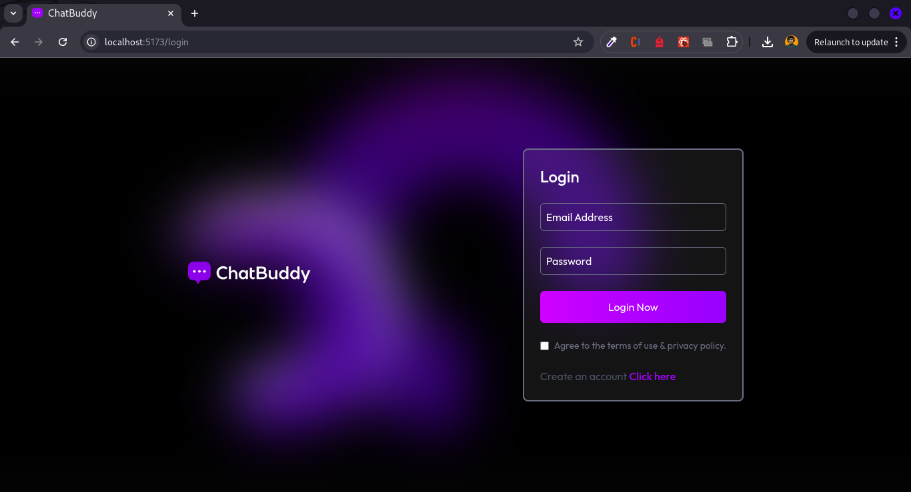
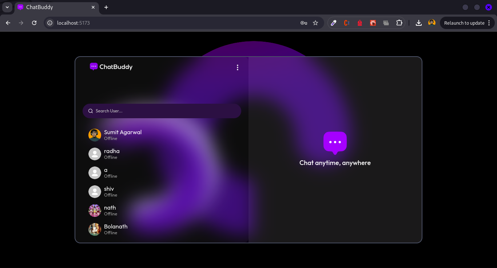

# ChatBuddy

ChatBuddy is a real-time full-stack chat application built using **React**, **Node.js**, **Socket.io**, and **MongoDB**. Users can register, log in, send text messages or images, see online statuses, and experience seamless real-time chatting.


## UI Sketch

Below is the initial UI sketch of ChatBuddy created using Excalidraw:
 


## 🖥️ Screenshots

### 🔐 Login Page



### 💬 Chat Interface




---

## ✨ Features

- 🔐 JWT-based authentication (Register / Login / Logout)
- 📡 Real-time messaging using Socket.IO
- 📷 Send & receive image messages (uploaded to Cloudinary)
- 🟢 Live online/offline status indicator
- 📬 Unseen message count
- 📁 Media preview section in sidebar
- 👤 Profile sidebar for the selected user
- 🧼 Clean & modern UI built with Tailwind CSS

---

## 🛠️ Tech Stack

### 👨‍💻 Frontend
- React 19
- React Router v7
- Tailwind CSS v4
- Axios
- Socket.IO Client
- React Hot Toast
- React Icons

### ⚙️ Backend
- Express.js
- MongoDB with Mongoose
- Socket.IO
- Cloudinary (for image upload)
- JWT Authentication
- dotenv & CORS

---

## 📁 Folder Structure (Simplified)

```
ChatBuddy/
├── frontend/
│   ├── public/
│   ├── src/
│   │   ├── components/
│   │   ├── context/
│   │   ├── assets/
│   │   ├── pages/
│   │   └── main.jsx
│   ├── tailwind.config.js
│   ├── vite.config.js
│   └── package.json
│
├── backend/
│   ├── controllers/
│   ├── models/
│   ├── routes/
│   ├── server.js
│   ├── config/
│   └── package.json
│
├── .env.example
└── README.md
```

---

## 🧪 Environment Variables

Create a `.env` file in the root of the **backend** folder and add:

```
PORT=5000
MONGODB_URI="your_mongodb_connection_uri"

CLOUDINARY_CLOUD_NAME="your_cloudinary_name"
CLOUDINARY_API_KEY="your_cloudinary_api_key"
CLOUDINARY_API_SECRET="your_cloudinary_api_secret"
```

---

## 🧑‍🏫 Getting Started

### 1. **Clone the repository**

```bash
git clone https://github.com/SumitGarg11/ChatBuddy
cd ChatBuddy
```

---

### 2. **Backend Setup**

```bash
cd backend
npm install
npm run server
```

> 🚀 Backend runs on: **http://localhost:5000**

---

### 3. **Frontend Setup**

```bash
cd frontend
npm install
npm run dev
```

> 💻 Frontend runs on: **http://localhost:5173**

---
## 🚀 Live Preview

> **Frontend:** Runs on [http://localhost:5173](http://localhost:5173)  
> **Backend:** Runs on [http://localhost:5000](http://localhost:5000)

---

## 🧠 Architecture Overview

- **Client-Side** handles all routing, real-time interactions, and UI logic.
- **Server-Side** handles API endpoints, authentication, socket logic, and cloud uploads.
- **Socket.IO** establishes WebSocket communication for real-time messaging and online presence.

---

## 🙌 Contributing

Contributions are welcome! If you find a bug or have a feature request, feel free to open an issue or submit a pull request.

---


## 📞 Contact

Made with ❤️ by **Sumit Garg**  
📫 [LinkedIn](https://www.linkedin.com/in/sumit-garg---/)
